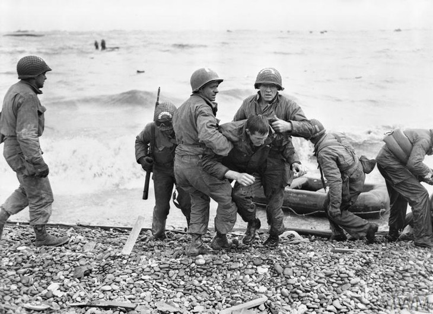

# 

el 6 de junio de 1944, más conocido como el Día D, durante el transcurso de la Segunda Guerra Mundial, las fuerzas aliadas lanzaron la mayor invasión anfibia y aerotransportada de la historia de la guerra en la operación nombrada en clave como Overlord.
Los desembarcos aliados en las playas de Normandía marcaron el comienzo de una larga y costosa campaña para liberar al noroeste de Europa de la ocupación nazi. En la mañana del día D, tropas de tierra desembarcaron en cinco playas de asalto: Utah, Omaha, Gold, Juno y Sword en lo que fue la operación de carácter naval complementaria desarrollada en el marco global de la operación Overlord, nombrada en clave como operación Neptuno. Al final del día, los Aliados se habían establecido en tierra y podían comenzar el avance hacia Francia. Cada playa fue un desafío diferente. Fueron estas:

# Utah beach
Más de 23.000 hombres de la 4ª división de infantería de los Estados Unidos aterrizaron en la playa de Utah, la más occidental de las playas del asalto. Las fuertes corrientes arrastraron la primera oleada de tropas hacia un sector más levemente defendido, a unos 1.800 metros al sur de su objetivo original. Las tropas aerotransportadas habían aterrizado tras la playa de Utah en las primeras horas del 6 de junio. Tras algunos periodos de intensa lucha, los paracaidistas finalmente aseguraron las calzadas a través de las tierras bajas inundadas, proporcionando una ruta para que las tropas en la playa se movieran hacia el interior. Al final del día, la 4ª división de infantería había avanzado aproximadamente de 6 kilómetros y medio. El coste en bajas fue se tradujo en unos 200 soldados entre muertos, heridos o desaparecidos.

