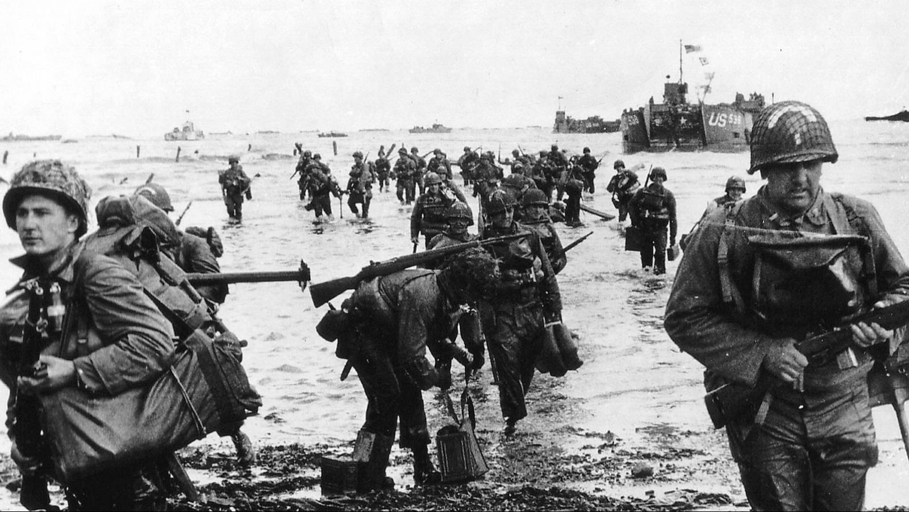

Día D es un término usado genéricamente por los militares aliados en la Segunda Guerra Mundial, para indicar el día en el que se efectuó un ataque, en una operación de combate. Históricamente, se utiliza el término Día D para referirse al 6 de junio de 1944 en la Segunda Guerra Mundial, día en el que comenzó a ejecutarse la denominada Operación Overlord. Dicha operación consistía en llevar a cabo un gran desembarco en las playas de Normandía como estrategia para abrir un nuevo frente en la Europa Occidental y reducir el dominio alemán, aunque empezó de madrugada con el aterrizaje de tres planeadores de la 6.ª División Aerotransportada del Ejército británico y la posterior toma del puente Pegasus por la Compañía D del 2.º Regimiento de Infantería Ligera de Oxfordshire y Buckinghamshire, integrada en la Brigada de Desembarco Aéreo de dicha División. En esta fecha la operación Overlord consiguió una cantidad importante de sus objetivos previstos, logrando que las tropas aliadas se adentraran en la costa francesa e iniciasen así la liberación de la Europa occidental ocupada por la Alemania nazi durante la Segunda Guerra Mundial.

El día original para el desembarco se había fijado para el 5 de junio de 1944, pero las malas condiciones meteorológicas y marítimas hicieron que el comandante supremo de los Aliados, Dwight David Eisenhower, la aplazara hasta el 6 de junio, dándoles más tiempo para ensayar sus movimientos. Debido a ello esta última fecha se conoce popularmente como el pequeño día D.

