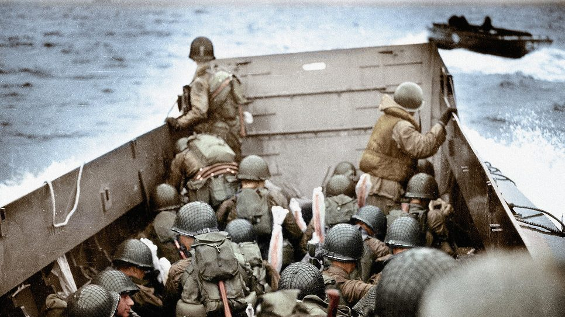

## El día d: las playas del desembarco de normandía

*[Playas del desembarco de Normandía](Normandia.md)

-El 6 de junio de 1944 se llevó a cabo la operación anfibia más importante de todos los tiempos en la costa de Normandía. Estas son las 5 playas que fueron el escenario de la historia.

